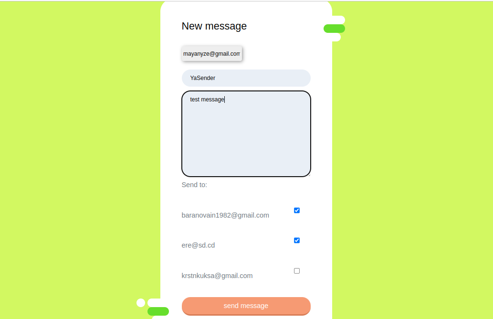
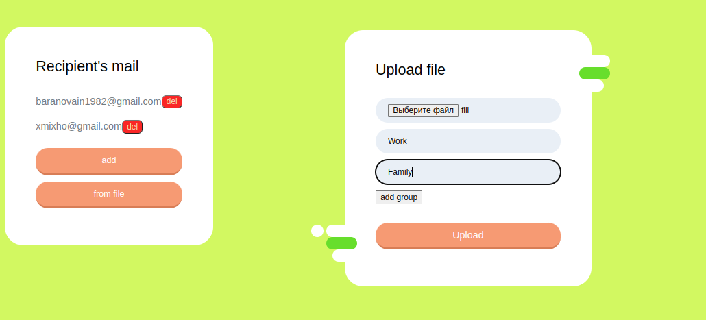
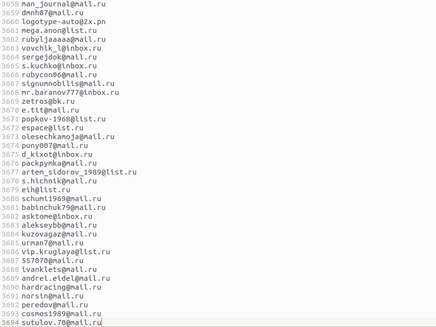

<h1 align="center">YaSender  🏪🌐📊 </h1>

#### A simple and useful site for sending emails to anyone


### 🛠 Demo version

  



Adding Email from file and create groups for this emails




Sending group emails


### 👷‍♂️Implemented on the site

* Adding an unlimited number of recipients
* Adding an unlimited number of senders
* Sending letters

### 👨🏻‍💻 Future Features
* Create mail groups and send messages to all users in one click
* Attaching files
* Possibility to add mail from JSON file
* Sent message feed
* Ability to send the same message to the same users in one click (from the feed)


😕As you can see, this project lacks a front-end developer.\
I always welcome your suggestions.\
My mail: xmixho@gmail.com

### ⚙️Project setup

```
git clone https://github.com/Mixnosha/YaSender.git
cd YaSender
pip install -r requirements.txt
python manage.py migrate
python manage.py runserver
```
